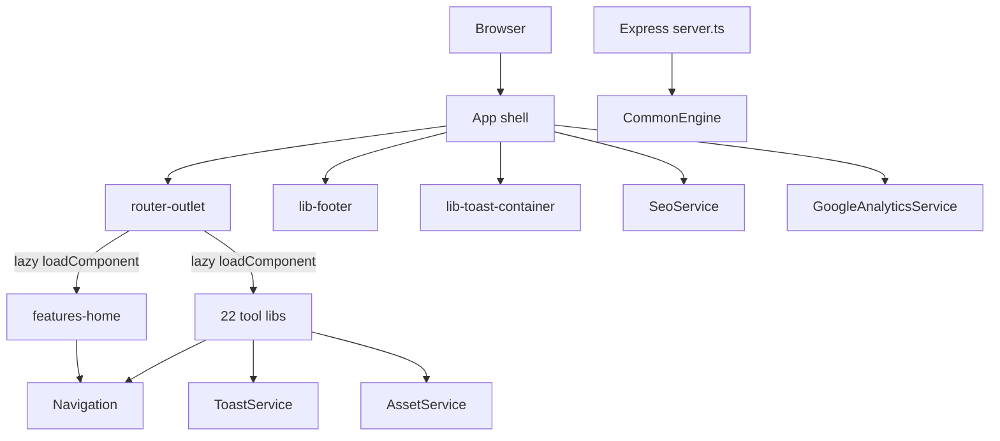
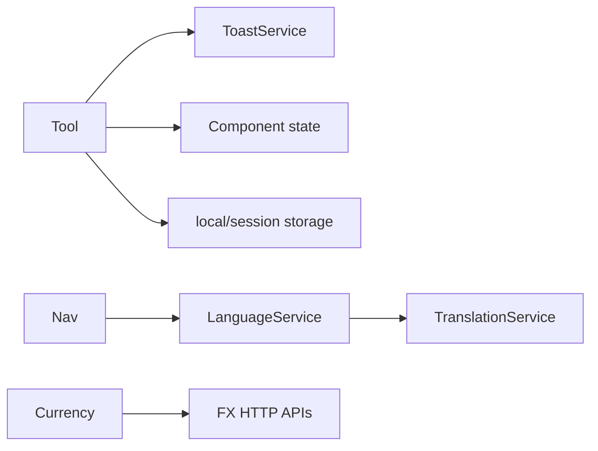
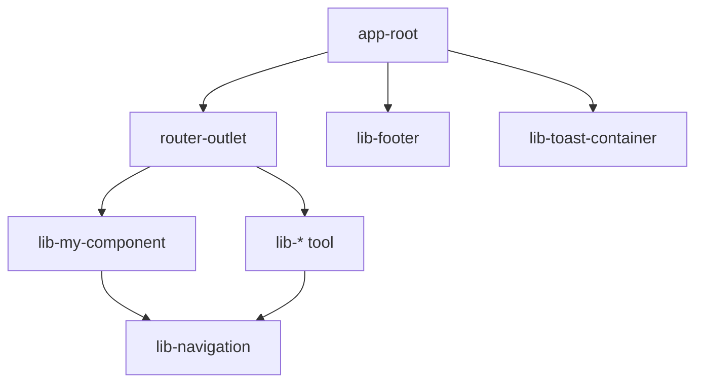
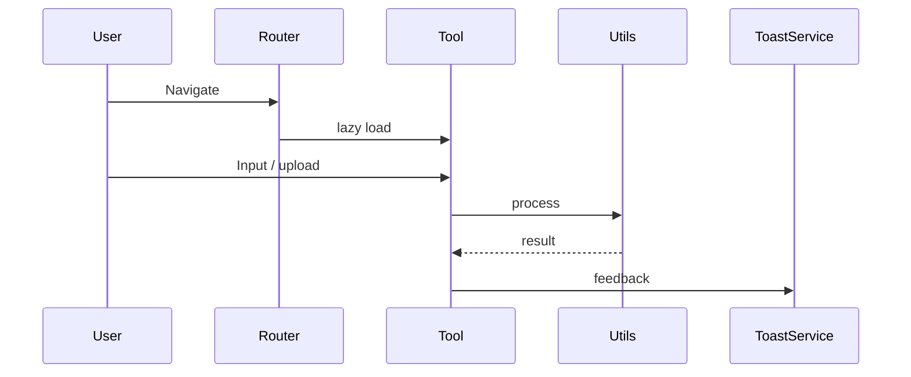
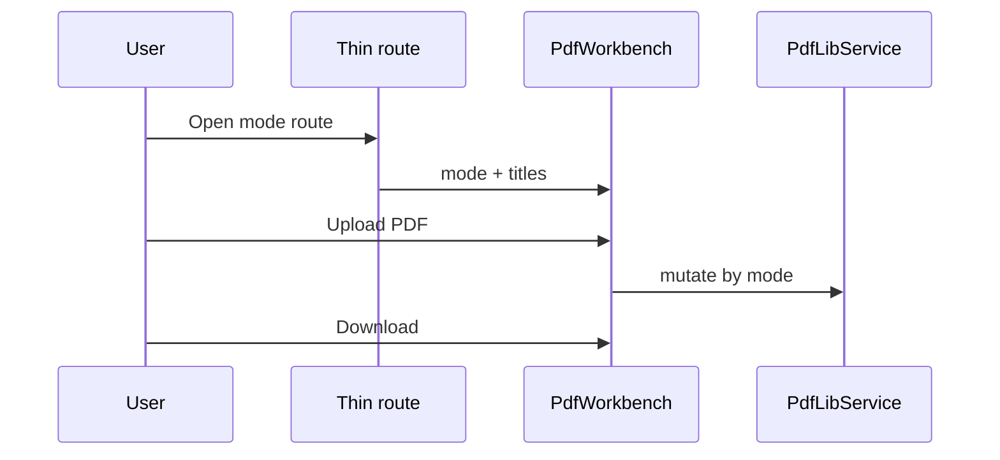
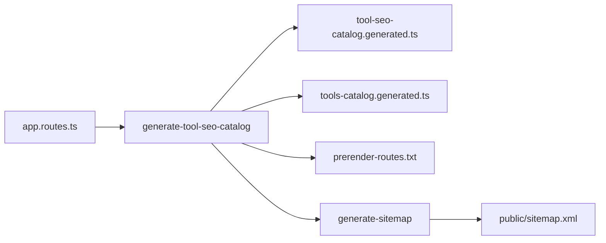
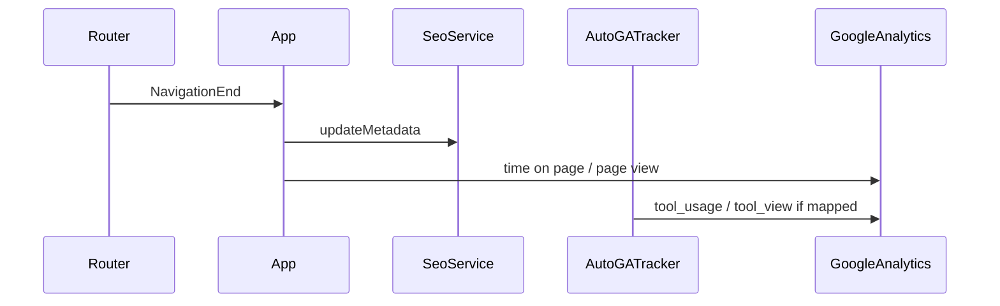

# Architecture

## Purpose

**EasyToolHub** (`@tools-workspace/source`) is a free browser toolkit at [easytoolhub.com](https://easytoolhub.com). Processing is almost entirely **client-side**. The Express SSR server serves HTML/static files only — **no product REST API**.

## Tech stack

| Layer | Technology |
| ----- | ---------- |
| Monorepo | Nx 21.6 |
| Framework | Angular ~20.3 (standalone components) |
| Language | TypeScript ~5.9 |
| Styling | SCSS |
| SSR | `@angular/ssr` + Express `CommonEngine` |
| Unit tests | Jest + jest-preset-angular |
| E2E | Playwright |
| Lint | ESLint 9 flat config |

**Bundled libs (notable):** `pdf-lib`, `signature_pad`, `tesseract.js`, `ngx-monaco-editor-v2`, `rxjs`, `pako`.

**CDN at runtime:** pdf.js, SheetJS, mammoth, marked, DOMPurify (markdown), JSZip, Chart.js, qrcode, JsBarcode, jspdf, html2canvas.

No NgRx, no app `environments/`, no HTTP interceptors, no route guards. Root `package.json` `"scripts": {}` — use `npx nx …`.

## Folder structure

```
tools-workspace/
├── apps/
│   ├── tools-site/          # SPA + SSR (routes, SEO, GA)
│   └── tools-site-e2e/      # Playwright
├── libs/                    # 23 libraries (@tools-workspace/*)
├── docs/                    # This documentation (canonical)
├── scripts/                 # SVG audit / stub helpers
├── nx.json
├── tsconfig.base.json
└── README.md                # Getting started only
```

Path aliases: `@tools-workspace/<lib>` → `libs/<lib>/src/index.ts`.

## Runtime architecture



| Layer | Responsibility |
| ----- | -------------- |
| `apps/tools-site` | Bootstrap, `app.routes.ts` (365 lazy routes), SEO, GA, shell |
| `features-home` (`type:shared`) | Home, nav, footer, toast, assets, i18n, coming-soon page |
| Feature libs (`type:feature`) | One tool (or PDF mode) per route; client logic + optional CDN |
| Build scripts | SEO catalog, prerender routes, sitemap |

### Routing

- Single table: `apps/tools-site/src/app/app.routes.ts`.
- Pattern: category parent → `children` with `loadComponent`.
- Coming-soon routes load shared `ComingSoonPageComponent` from `features-home`.
- `''` and `**` redirect toward `tools`.

### Design choices

1. Thin app, fat libs  
2. Lazy per-tool chunks  
3. Privacy-first client processing (FX rates are the main outbound product API)  
4. Shell shared via `features-home` (`type:shared`; Navigation still coupled to the generated catalog)  
5. PDF: mode-driven workbenches; Text: many tools extend `TextToolBase`

Hardcoded: SEO base `https://easytoolhub.com`, GA `G-C7L2T1RHVW`.

---

## State management

No global UI store.

| Pattern | Where |
| ------- | ----- |
| Component fields / Angular signals | Most tools |
| `BehaviorSubject` | `ToastService`, `LanguageService`, `TranslationService` |
| In-memory `Map` cache | `CurrencyRateService`, GA session sets |
| Signal stores | Unit-converter preset/history |
| `localStorage` | Theme (`theme`), language, clipboard history, some tool history |
| `sessionStorage` | PDF workbench (`easytoolhub.pdf.session`) |

**Theme caveat:** shell uses key `theme`; home also references `easytoolhub.theme` in places — can desync.



**Guidance:** keep utils pure; use signals + OnPush for new UIs; root services only for cross-route concerns.

---

## Architecture diagrams

### Component hierarchy



### Typical tool flow



### PDF workbench



### Build catalog pipeline



### SEO + GA on navigation


