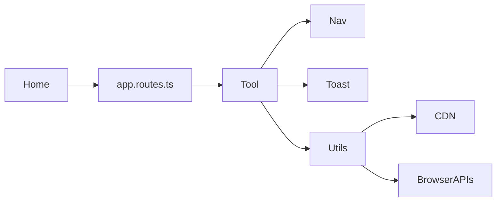

# Features

Each category is one Nx library (except home/shell in `features-home`). Flows are browser-local unless noted.

**Full tool list with routes and status:** [tools-inventory.md](./tools-inventory.md)

## Implementation summary

| Status | Count | Description |
| ------ | ----- | ----------- |
| Live | 343 | Fully routed with working UI |
| Coming soon | 23 | Placeholder page or stub component (`noindex`) |
| Partial | 3 | Route live; core feature not yet wired |

---

## Cross-cutting

| Feature | Location | Notes |
| ------- | -------- | ----- |
| Home / discovery | `libs/features-home/.../myComponent/` | Search + catalog from generated config |
| Navigation / theme | `.../navigation/` | Mega-menu, language, dark mode (`localStorage` `theme`) |
| Toasts | `ToastService` + container in `App` | Used by ~all tools |
| SEO | `SeoService` + generated catalog | See [guides/seo.md](./guides/seo.md) |
| Analytics | GA4 + AutoGA | See [guides/analytics.md](./guides/analytics.md) |
| i18n | 4 JSON locales, ~20 keys | Chrome only; tools English; asset path may not ship — see [quality.md](./quality.md) |
| SSG / prerender | `outputMode: static` + `RenderMode.Prerender` | Crawlable HTML; deploy browser dist only |
| Coming soon | `ComingSoonPageComponent` + `isComingSoon` stubs | 23 routes excluded from sitemap |

---

## Categories

### Text utilities — `libs/text-utilities` (30 live)

Encode/decode, transform, analyze, merge. Typical flow: paste/upload → options → live process → copy/download. Many extend `TextToolBase` (undo/redo, 10 MB upload).

Deps: Monaco (diff), pako, CDN jspdf (word-counter export).

### File viewers — `libs/file-viewers` (26 live · 20 coming soon)

In-browser preview for office docs, images, archives, ebooks, SVG/PSD/HEIC/TIFF, audio, fonts, calendars, **3D meshes**, and more.

**Live:** image, PDF, Word, PowerPoint, text, markdown, Excel, log, audio player, font, **3D model** (tool-api inspect/normalize → GLB + model-viewer), archive, XES, EPUB, MOBI, LaTeX, SVG, PSD, AI, HEIC, RAW, TIFF, OpenDocument, RTF, ICS calendar.

**Coming soon (19 placeholders + video player stub):** subtitle, MIDI, MusicXML, APK, IPA, ELF, PE, WAV spectrum, spectrogram, Minecraft/Unity/game-save, NFT/smart-contract, invoice/audit, Figma/Sketch/InDesign, video player.

### Data converters — `libs/data-converters` (8 live)

CSV⇄JSON, Excel→JSON, HTML table→JSON, JSON tools, Markdown⇄HTML, YAML⇄JSON (custom YAML parser).

### Math & date — `libs/math-date-utils` (13 live · 1 partial)

Calculators + unit/currency. Currency uses FX HTTP (see [api.md](./api.md)).

**Partial:** unit converter works; history clear/export UI toasts "coming soon".

### PDF tools — `libs/pdf-tools` (31 live)

| Kind | Examples |
| ---- | -------- |
| Full UIs | merge, split, signature, viewer |
| Edit workbench | Thin routes set `PdfToolMode` on `PdfWorkbenchComponent` |
| Create workbench | Thin routes → `PdfJspdfWorkbenchComponent` |

Services: `PdfLibService`, `PdfJsLoaderService`, `PdfPreviewService`, `PdfJspdfService`. May persist PDF bytes in `sessionStorage`.

### Image & color — `libs/image-color-tools` (10 live)

Canvas tools + OCR via dynamic `tesseract.js`.

### Code & file — `libs/code-file-tools` (9 live)

Minifiers, clipboard viewer/history (plaintext in `localStorage`), markdown→PDF.

### Dev & design — `libs/dev-design-tools` (12 live)

CSS generators, Postman Lite (`fetch`), CORS tester, WebSocket client, mock JSON, etc.

### Testing — `libs/testing-tools` (6 live)

Validators, JWT **decoder** (not signature verify unless utils say otherwise), UA parser.

### Security — `libs/security-tools` (7 live)

Hash, passwords, AES-GCM helpers (`st-aes-gcm.util.ts`), UUID, private notes, secure clipboard.

### Media — `libs/media-tools` (2 live · 3 coming soon · 1 partial)

| Tool | Status |
| ---- | ------ |
| Voice recorder | Live |
| Audio player (media) | Partial — UI shell; playback/playlist not wired |
| Audio trimmer, video→GIF, webcam snapshot | Coming soon — utils exist, UI disabled |

### Browser utils — `libs/browser-utils` (6 live)

Battery, cookies, orientation, speed test (default Hetzner 1MB bin), screen info, storage viewer.

### Fun tools — `libs/fun-tools` (11 live)

QR/barcode (CDN), timers, lorem, typing test, timezone, etc.

### CAD viewers — `libs/cad-viewers` (29 live)

DWG/DXF/DWF/DGN, STEP/IGES, SolidWorks/Fusion/Inventor/Creo, Rhino/SketchUp, Gerber/KiCad/Eagle/Altium, IFC/Revit/Navisworks, BIM/MEP/floor-plan/structural. Most accept dump/JSON/CSV; binary CAD parsing is limited — education/research disclaimers in UI.

### GIS viewers — `libs/gis-viewers` (20 live)

GeoJSON, GPX, Shapefile, KML/KMZ, TopoJSON, GeoPackage, MBTiles, GeoTIFF/COG, DEM/terrain, contours, GPS/drone, LiDAR/point cloud, satellite, vector tiles, raster map.

### Medical viewers — `libs/medical-viewers` (18 live)

DICOM, NIfTI, MRI/CT/X-ray/ultrasound/mammography/PET, NRRD/MINC, pathology/WSI, ECG/EEG, HL7/FHIR/CDA, medical timeline.

### Science viewers — `libs/science-viewers` (20 live)

HDF5, NetCDF, FITS, GRIB, MATLAB MAT, ROOT, molecular/protein, FASTA/FASTQ/GenBank/VCF, LAS/DLIS/SEG-Y, geological/borehole/stratigraphy, climate, simulation. Some formats show "incomplete parse" warnings (FITS HDUs, DLIS SUL).

### Network viewers — `libs/network-viewers` (17 live)

HAR, PCAP/PCAPng, traffic/packet/protocol, HTTP trace, API request, firewall/SIEM/syslog/DNS logs, Nmap/Nessus/SARIF, malware/threat intel.

### Process viewers — `libs/process-viewers` (15 live · 1 partial)

BPMN (+ analytics), DMN, decision model, EPC, PNML, Petri net, BPEL, workflow/process map, process mining, event log, trace explorer, timeline, business-process simulator.

**Partial:** BPMN viewer — diagram import/render live; text-to-diagram tab marked coming soon.

### Diagram viewers — `libs/diagram-viewers` (29 live)

Mermaid, PlantUML, Graphviz, UML/class/sequence, C4/architecture, GraphML/GEXF, mind maps (FreeMind/Freeplane/concept), ER/DBML/SQL/Prisma, draw.io/Visio, Terraform/K8s/dependency graphs, RDF/OWL/knowledge graph, state machine, decision tree, Drools.

### Data explorers — `libs/data-explorers` (15 live)

Parquet, Avro, ORC, Feather, Arrow, Delta Lake, SQLite, DuckDB, CSV/TSV, JSON/XML/YAML/TOML/INI.

### ML viewers — `libs/ml-viewers` (9 live)

ONNX, TensorFlow graph, PyTorch, Keras, MLflow, neural-network graph, model architecture, tensor visualization, pickle.

---

## Remaining implementation

### Coming soon routes (23)

**Media (3):** `/media-tools/audio-trimmer`, `/video-to-gif`, `/webcam-snapshot`

**File viewers (20):** `/file-viewers/video-player` (stub) + 19 placeholder pages (subtitle through InDesign — see [tools-inventory.md](./tools-inventory.md))

### Partial features (3)

| Route | Gap |
| ----- | --- |
| `/media-tools/audio-player` | Waveform, playlist, seek, speed |
| `/math-date-utils/unit-converter` | History management UI |
| `/process-viewers/bpmn-viewer` | Text-to-diagram preview |

---

## Future enhancements

### Platform

- Finish 23 coming-soon + 3 partial tools
- Shared `@tools-workspace/shared-utils` for clipboard/download helpers
- PWA / offline CDN cache for core text/security tools
- Home favorites / recent tools; coming-soon badges in nav
- Real i18n rollout (or shrink language picker to 4 shipped locales)
- Accessibility audit (mega-menu, toasts, contrast)
- AutoGA map generated from routes; CI route/catalog parity

### Per-category themes

| Category | Ideas |
| -------- | ----- |
| CAD | Native binary parsers; WebGL 3D preview |
| GIS | Large-file streaming; COG tile integration |
| Medical | DICOM MPR; series anonymization export |
| Science | Full FITS/DLIS/GRIB spec; compressed HDF5/NetCDF |
| Network | PCAP performance; STIX/TAXII threat feeds |
| Process | BPMN simulation export; XES conformance |
| Diagram | Serverless PlantUML; draw.io embed |
| PDF | OCR layer; batch mode |
| ML | ONNX runtime inference preview |

Long-form viewer roadmap: [future-file-viewers.md](./future-file-viewers.md). Technical debt: [quality.md](./quality.md).

---

## Interaction map

