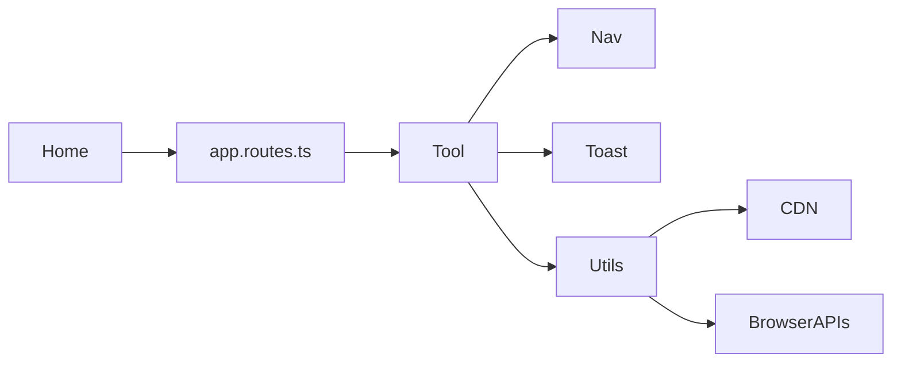

# Features

Each category is one Nx library (except home/shell in `features-home`). Flows are browser-local unless noted.

## Cross-cutting

| Feature | Location | Notes |
| ------- | -------- | ----- |
| Home / discovery | `libs/features-home/.../myComponent/` | Search + catalog from generated config |
| Navigation / theme | `.../navigation/` | Mega-menu, language, dark mode (`localStorage` `theme`) |
| Toasts | `ToastService` + container in `App` | Used by ~all tools |
| SEO | `SeoService` + generated catalog | See [guides/seo.md](./guides/seo.md) |
| Analytics | GA4 + AutoGA | See [guides/analytics.md](./guides/analytics.md) |
| i18n | 4 JSON locales, ~20 keys | Chrome only; tools English; asset path may not ship — see [quality.md](./quality.md) |
| SSR / prerender | Express + `prerender-routes.txt` | Transparent to users |

## Categories

### Text utilities — `libs/text-utilities` (30)

Encode/decode, transform, analyze, merge. Typical flow: paste/upload → options → live process → copy/download. Many extend `TextToolBase` (undo/redo, 10 MB upload).

Deps: Monaco (diff), pako, CDN jspdf (word-counter export).

### File viewers — `libs/file-viewers` (13)

In-browser preview. CDN: pdf.js, mammoth, JSZip, SheetJS, marked + DOMPurify (markdown), Chart.js.

**Coming soon:** `video-player`, `3d-model-viewer`.

### Data converters — `libs/data-converters` (8)

CSV⇄JSON, Excel→JSON, HTML table→JSON, JSON tools, Markdown⇄HTML, YAML⇄JSON (custom YAML parser).

### Math & date — `libs/math-date-utils` (13)

Calculators + unit/currency. Currency uses FX HTTP (see [api.md](./api.md)). Unit-converter history UI still toasts “coming soon”.

### PDF tools — `libs/pdf-tools` (~34)

| Kind | Examples |
| ---- | -------- |
| Full UIs | merge, split, signature, viewer |
| Edit workbench | Thin routes set `PdfToolMode` on `PdfWorkbenchComponent` |
| Create workbench | Thin routes → `PdfJspdfWorkbenchComponent` |

Services: `PdfLibService`, `PdfJsLoaderService`, `PdfPreviewService`, `PdfJspdfService`. May persist PDF bytes in `sessionStorage`.

### Image & color — `libs/image-color-tools` (10)

Canvas tools + OCR via dynamic `tesseract.js`.

### Code & file — `libs/code-file-tools` (9)

Minifiers, clipboard viewer/history (plaintext in `localStorage`), markdown→PDF.

### Dev & design — `libs/dev-design-tools` (12)

CSS generators, Postman Lite (`fetch`), CORS tester, WebSocket client, mock JSON, etc.

### Testing — `libs/testing-tools` (6)

Validators, JWT **decoder** (not signature verify unless utils say otherwise), UA parser.

### Security — `libs/security-tools` (7)

Hash, passwords, AES-GCM helpers (`st-aes-gcm.util.ts`), UUID, private notes, secure clipboard.

### Media — `libs/media-tools` (5)

| Tool | Status |
| ---- | ------ |
| Voice recorder | Implemented |
| Audio player, trimmer, video→GIF, webcam | Coming soon (utils may exist, UI not wired) |

### Browser utils — `libs/browser-utils` (6)

Battery, cookies, orientation, speed test (default Hetzner 1MB bin), screen info, storage viewer.

### Fun tools — `libs/fun-tools` (11)

QR/barcode (CDN), timers, lorem, typing test, timezone, etc.

## Coming soon (confirmed in UI)

1. `/media-tools/audio-player`  
2. `/media-tools/audio-trimmer`  
3. `/media-tools/video-to-gif`  
4. `/media-tools/webcam-snapshot`  
5. `/file-viewers/video-player`  
6. `/file-viewers/3d-model-viewer`  

## Interaction map

